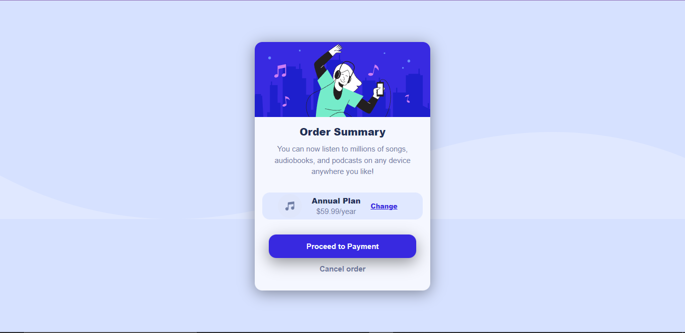

# Frontend Mentor - Order summary card

## Table of contents

- [Overview](#overview)
  - [Links](#links)
- [My process](#my-process)
  - [Built with](#built-with)
  - [What I learned](#what-i-learned)
  - [Continued development](#continued-development)
- [Author](#author)

## Overview

### Links

[FEM-Solution](https://your-solution-url.com)
[Live Site](https://dapper-crepe-b4a1c0.netlify.app/)

## My process

### Built with

- Semantic HTML5 markup
- Flexbox
- Sass

### What I learned

It was really fun building this card.
I finally learnt how to make a the use the width and height propety in the right way.

If you want more help with writing markdown, we'd recommend checking out [The Markdown Guide](https://www.markdownguide.org/) to learn more.

### Continued development

Now i want to go deeper in to layouts.
It really is going to be a long journey but it feels like am almost at the end of my destination;

## Author

- Website - [Add your name here](https://www.your-site.com)
- Frontend Mentor - [@yourusername](https://www.frontendmentor.io/profile/yourusername)
- Twitter - [@yourusername](https://www.twitter.com/yourusername)
